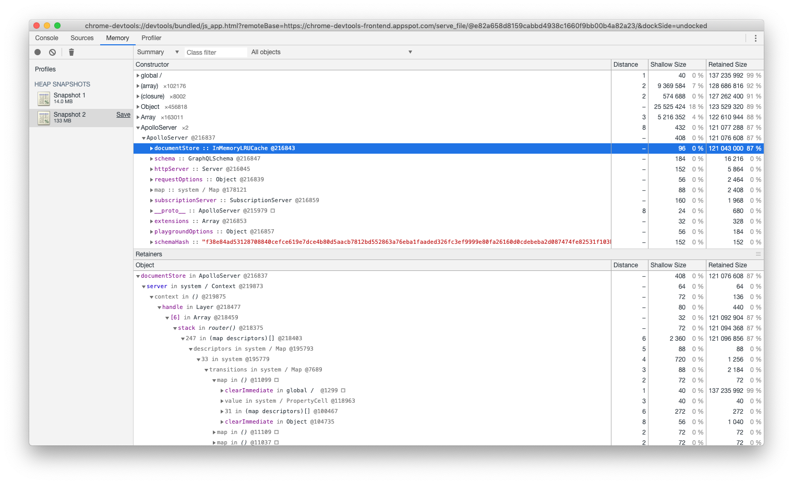

# Introduction

This project replicates the memory leak issue introduced in [#2111](https://github.com/apollographql/apollo-server/pull/2111).

# Requirements

 * [wrk](https://github.com/wg/wrk) is required to generate queries
    `brew install wrk`

# Steps

 1. `yarn install`
 2. `yarn run server &`
 3. Open the Google chrome inspector at chrome://inspect and connect to
    the server.
 4. Take a heap snapshot
 5. `./wrk.sh`
 6. Take a heap snapshot

The snapshot will show a significant amount of memory used (more than
the 30mb limit)

